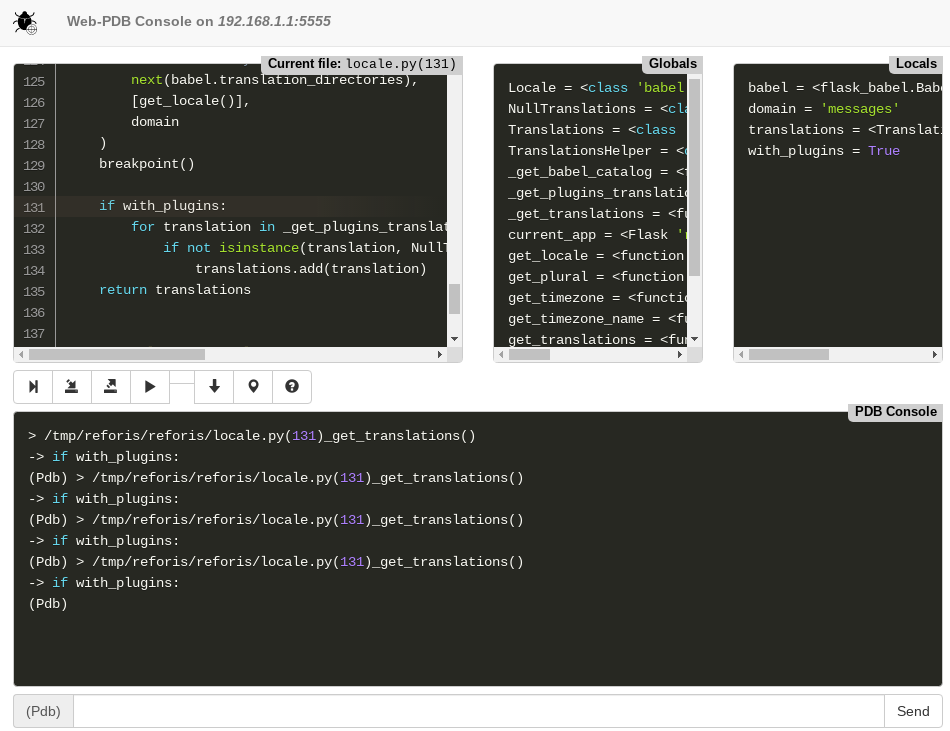

# Interactive debugging

Sometimes it is needed to debug certain behavior on live system, i.e. debug flask during runtime.

**Prerequisities:**

* python3 >= 3.7
* python3-pip

## Remote debugging with web-pdb

* install `web-pdb`

```sh
pip3 install web-pdb
```

* set env variable `PYTHONBREAKPOINT` for lighttpd process in its init script `/etc/init.d/lighttpd`

```sh
start_service() {
    procd_set_param env PYTHONBREAKPOINT=web_pdb.set_trace
    [...]
}
```

* add `breakpoint()` to code relevant section. E.g.:

```python
babel = current_app.extensions['babel']
translations = TranslationsHelper.load(
    next(babel.translation_directories),
    [get_locale()],
    domain
)
breakpoint()
```

* let the `web-pdb` open when code reaches `breakpoint()`
* open <http://turris.lan:5555> in web browser and continue debugging

**Example:**



### References

* <https://hackernoon.com/python-3-7s-new-builtin-breakpoint-a-quick-tour-4f1aebc444c>

# Python Logging
By default the python log level is set to `WARNING`. If you want to use more verbose level,
set env variable `REFORIS_LOG_LEVEL` to other level.

```bash
export REFORIS_LOG_LEVEL=DEBUG
```
